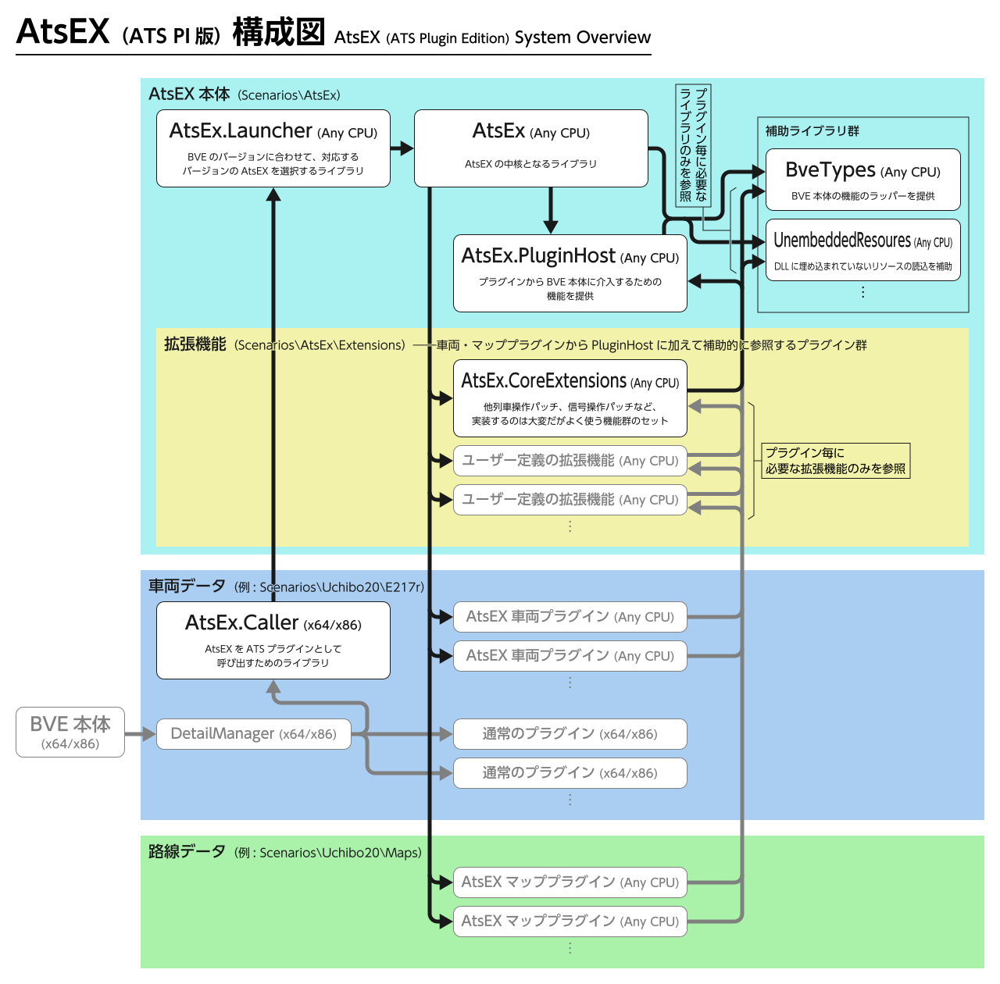
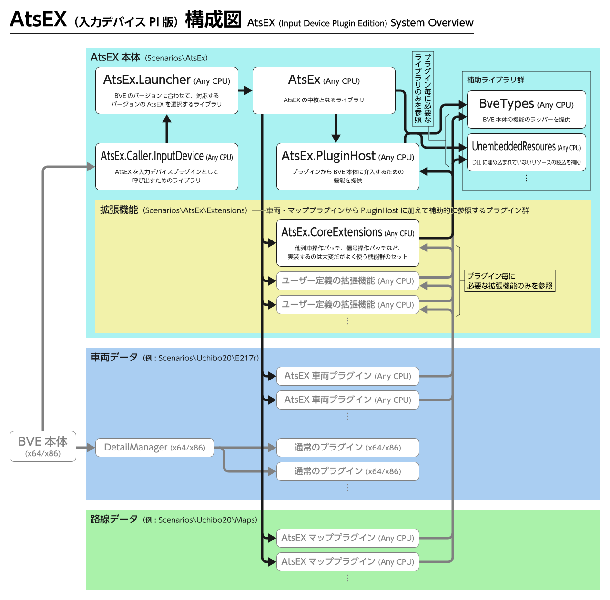

  ) )

# AtsEX
【BVE5・6向け】ATSプラグインの機能を拡張するプラグインです。

詳細は→https://automatic9045.github.io/

## 名前の由来
**ATS**プラグインを拡張（**ex**tend）するプラグイン

## ライセンス
[The MIT License](LICENSE)

## リリースのダウンロード

[こちら](https://github.com/automatic9045/AtsEX/releases)

## AtsEX 本体のビルド手順

[こちら](HowToBuild.md)

### 【！！注意！！】プラグインを開発するための手順ではありません

**AtsEX 本体のソースコードを編集するための手順です。AtsEX を利用してプラグインを開発する場合はこちらではなく[リリース](https://github.com/automatic9045/AtsEX/releases)を参照してください。**

## プロジェクトの構成

### ATS プラグイン版

### 入力デバイスプラグイン版

## 使用ライブラリ等（アルファベット順）

#### [.NET Runtime](https://github.com/dotnet/runtime) (MIT)

Copyright (c) .NET Foundation and Contributors

`System.Collection.Generic.SortedList<Tkey, TValue>` のソースを一部流用しています。

#### [DllExport](https://github.com/3F/DllExport) (MIT)

Copyright (c) 2009-2015  Robert Giesecke  
Copyright (c) 2016-2021  Denis Kuzmin <x-3F@outlook.com> github/3F

#### [DXDynamicTexture](https://github.com/zbx1425/DXDynamicTexture) (MIT)

Copyright (c) 2021 zbx1425

#### [DynamicLanguageRuntime](https://github.com/IronLanguages/dlr) (Apache-2.0)

Copyright (c) .NET Foundation and Contributors

#### [Harmony](https://github.com/pardeike/Harmony) (MIT)

Copyright (c) 2017  Andreas Pardeike

#### [IronPython](https://ironpython.net/) (Apache-2.0)

Copyright (c) .NET Foundation and Contributors

#### [Markdig](https://github.com/xoofx/markdig) (BSD-2-Clause)

Copyright (c) 2018-2019, Alexandre Mutel

#### [Microsoft.CodeAnalysis.Analyzers](https://github.com/dotnet/roslyn-analyzers) (MIT)

Copyright (c) .NET Foundation and Contributors

#### [Microsoft.CodeAnalysis.Common](https://github.com/dotnet/roslyn) (MIT)

Copyright (c) .NET Foundation and Contributors

#### [Microsoft.CodeAnalysis.CSharp](https://github.com/dotnet/roslyn) (MIT)

Copyright (c) .NET Foundation and Contributors

#### [Microsoft.CodeAnalysis.CSharp.Scripting](https://github.com/dotnet/roslyn) (MIT)

Copyright (c) .NET Foundation and Contributors

#### [Microsoft.CodeAnalysis.Scripting](https://github.com/dotnet/roslyn) (MIT)

Copyright (c) .NET Foundation and Contributors

#### [Microsoft.CodeAnalysis.Scripting.Common](https://github.com/dotnet/roslyn) (MIT)

Copyright (c) .NET Foundation and Contributors

#### [Microsoft.CSharp](https://github.com/dotnet/corefx) (MIT)

Copyright (c) .NET Foundation and Contributors

#### [Octokit](https://github.com/octokit/octokit.net) (MIT)

Copyright 2017 GitHub, Inc.

#### [SlimDX](https://www.nuget.org/packages/SlimDX/) (MIT)

Copyright (c) 2013  exDreamDuck

#### [System.Buffers](https://github.com/dotnet/corefx) (MIT)

Copyright (c) .NET Foundation and Contributors

#### [System.Collections.Immutable](https://github.com/dotnet/runtime) (MIT)

Copyright (c) .NET Foundation and Contributors

#### [System.Memory](https://github.com/dotnet/corefx) (MIT)

Copyright (c) .NET Foundation and Contributors

#### [System.Numerics.Vectors](https://github.com/dotnet/corefx) (MIT)

Copyright (c) .NET Foundation and Contributors

#### [System.Reflection.Metadata](https://github.com/dotnet/runtime) (MIT)

Copyright (c) .NET Foundation and Contributors

#### [System.Runtime.CompilerServices.Unsafe](https://github.com/dotnet/runtime) (MIT)

Copyright (c) .NET Foundation and Contributors

#### [System.Text.Encoding.CodePages](https://github.com/dotnet/runtime) (MIT)

Copyright (c) .NET Foundation and Contributors

#### [System.Threading.Tasks.Extensions](https://github.com/dotnet/corefx) (MIT)

Copyright (c) .NET Foundation and Contributors

### サンプルシナリオにのみ含まれるもの

#### [KeyboardFont_Plus](http://www.gaiji.info/) (CC BY-ND 3.0)

フォント by 外字神社 is licensed under a [Creative Commons 表示 - 改変禁止 3.0 Unported License.](http://creativecommons.org/licenses/by-nd/3.0/)

www.gaiji.info にある作品に基づいている。
